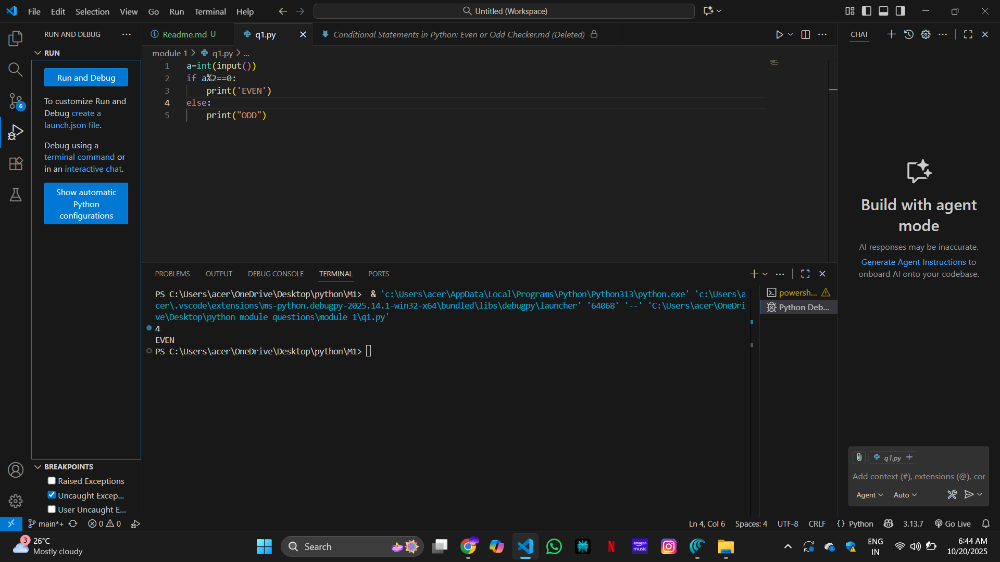
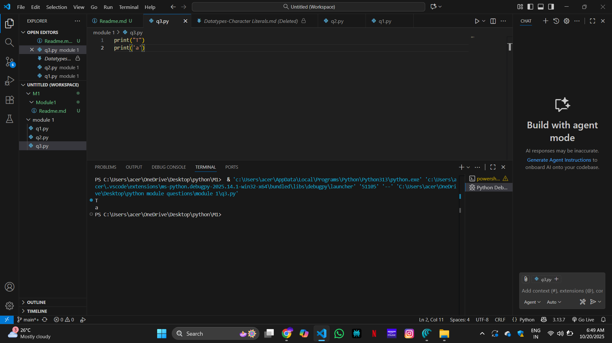
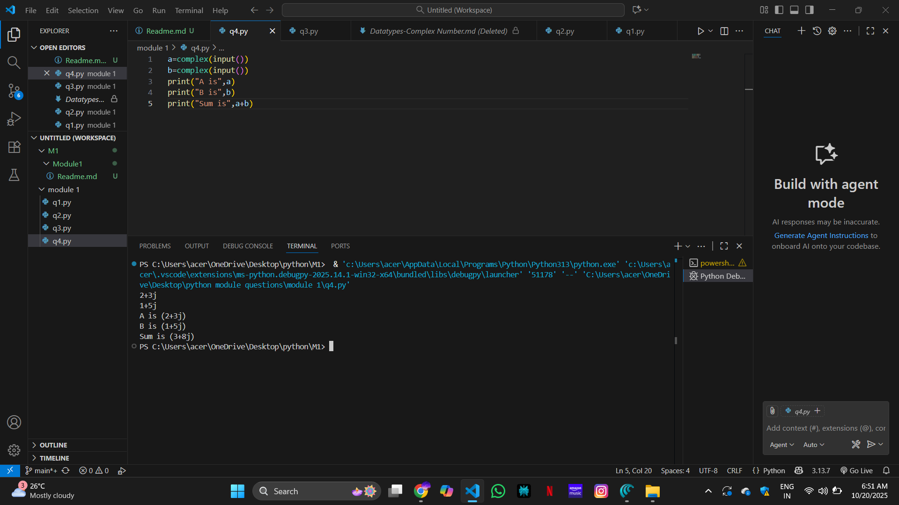
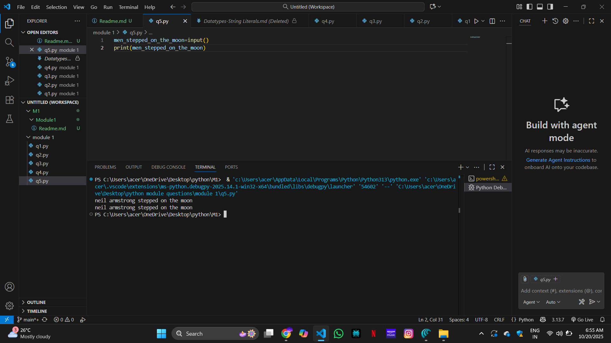

# Conditional Statements in Python: Even or Odd Checker

## 🎯 Aim
To write a Python program to check whether the given number is **even** or **odd** using `if...else` statements.

## 🧠 Algorithm
1. Get an input from the user.
2. Convert the input to an integer and store it in a variable `a`.
3. Use the modulo operator `%` to check if `a % 2 == 0`.
   - If true, print `"EVEN"`.
   - Else, print `"ODD"`.
4. End the program.

## 🧾 Program
'''
a=int(input())
if a%2==0:
    print('EVEN')
else:
    print("ODD")
'''
## Output

## Result
The python code for checking odd or even is suucessfully executed

# Ex 1:Datatypes-Boolean Expression Evaluation in Python

## 🎯 Aim
To write a Python program that evaluates and prints the results of boolean and arithmetic expressions involving `True` and `False`.

## 🧠 Algorithm
1. Set variable `a` to the result of the expression `0 == True`.
2. Set variable `b` to the result of the expression `False == False`.
3. Set variable `c` to the result of the expression `True + True`.
4. Set variable `d` to the result of the expression `False + 9`.
5. Print the value of `a` with the label "a is".
6. Print the value of `b` with the label "b is".
7. Print the value of `c` with the label "c:".
8. Print the value of `d` with the label "d:".

## 💻 Program
'''
a=1
b=1
c=1
d=0
a = (1 == True)
b = (1 == False)
c = True + 3
d = False + 7
print("a is",a)
print("b is",b)
print("c:",c)
print("d:",d)
'''

## Output

## Result
The python code for Boolean Expression is succesfully executed

# Datatypes-Character Literal in Python

## 🎯 Aim
To write a Python program that prints the characters `'T'` and `'a'` using character literals.

## 🧠 Algorithm
1. Print the character `'T'`.
2. Print the character `'a'`.

## 🧾 Program
'''
print("T")
print('a')
'''
## Output

## Result
The python code for printing the character literals is successfully executed 

# 🧮 Datatypes-Complex Number Creation in Python

## 🎯 Aim
To write a Python program that reads two integers, creates a complex number using them, and then prints the complex number along with its real and imaginary parts.

## 🧠 Algorithm
1. Read an integer input from the user and assign it to the variable `a` (real part).
2. Read another integer input from the user and assign it to the variable `b` (imaginary part).
3. Create a complex number `x` using the `complex(a, b)` function.
4. Print the complex number `x`.
5. Print the real part of `x` using `x.real`.
6. Print the imaginary part of `x` using `x.imag`.

## 💻 Program
'''
a=complex(input())
b=complex(input())
print("A is",a)
print("B is",b)
print("Sum is",a+b)
'''

## Output

## Result
The python program for complex numbers is successfully executed

# Datatypes-Read and Print a String in Python

## 🎯 Aim
To write a Python program to read a string from the user and then print it.

## 🧠 Algorithm
1. Assign a variable named `men_stepped_on_the_moon`.
2. Use `input()` to read a string from the user and store it in the variable.
3. Print the value stored in the variable.

## 🧾 Program
'''
men_stepped_on_the_moon=input()
print(men_stepped_on_the_moon)
'''
## Output

## Result

The python program for reading and printing strings is successfully executed